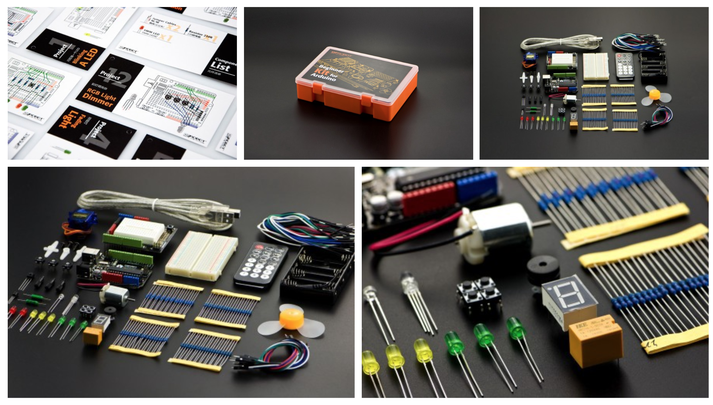
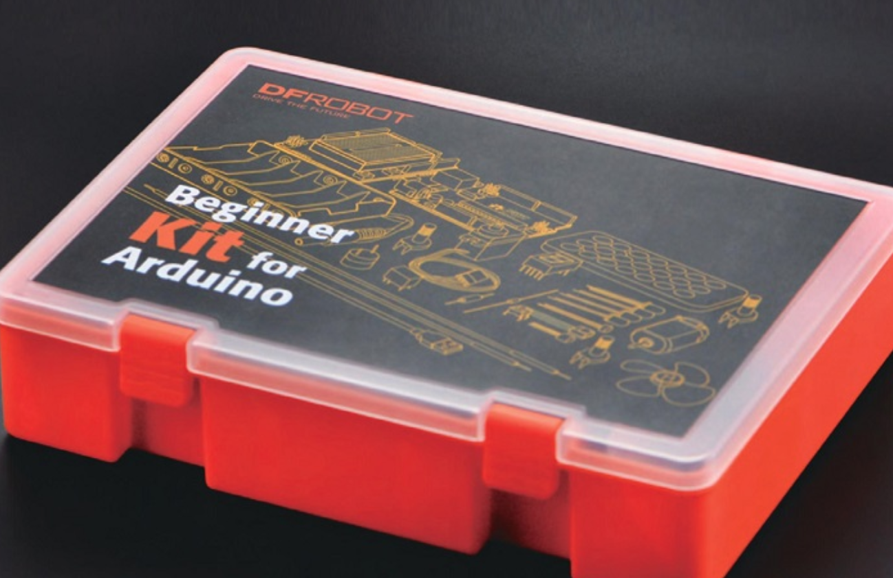
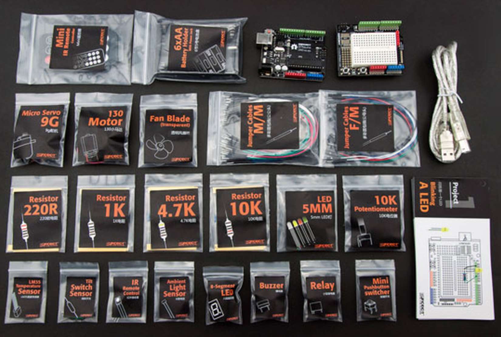
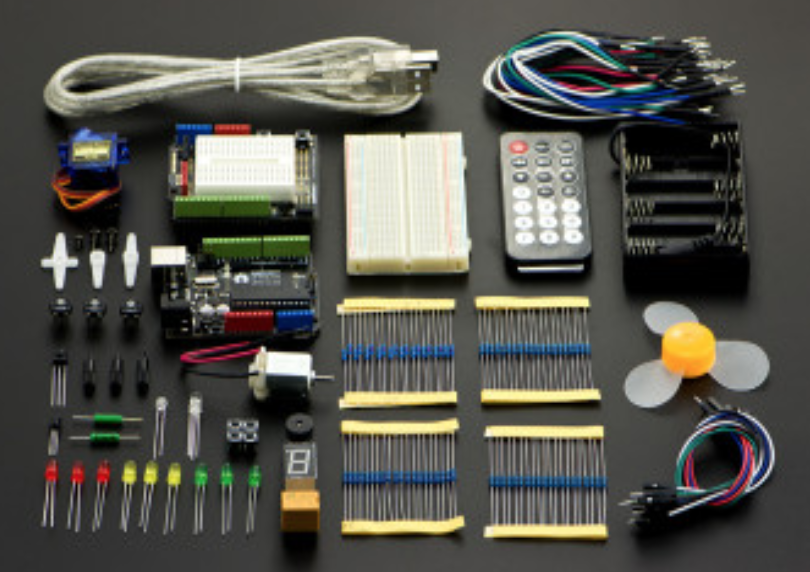

- Code for an Arduino Boot Camp with emphasis on ditching delay(), basic object-oriented programming, and clean readable code.

# [Arduino Boot Camp Website](http://mithi.github.io/arduino-basic/)

# [PDF: Pitch: Not your usual Arduino Bootcamp](./docs/abc-2.pdf)
# [PDF: Pitch 2](./docs/abc-1.pdf)

# Materials

  - Arduino UNO R3  x1
  - Jumper Cables M/M x30
  - Jumper Cables F/M x10
  - Resistor 220R x20
  - Resistor 4.7K x20
  - Resistor 10K x20
  - Resistor 1K x20
  - 5mm LED x10
  - Mini Push Button x4
  - Ambient Light Sensor x1
  - Tilt Switch Sensor x1
  - 8-Segment LED x1
  - LM35 Temperature Sensor x1
  - Relay x1
  - Buzzer x1
  - Fan x1
  - 130 Motor x1
  - 10K Potentiometer x3
  - Micro Servo x1
  - Mini Controller (with battery CR2025 inside) x1
  - 6 x AA Battery Holder x1
  - 400 Tie Point Interlocking Solderless Breadboard  x1

| | | |
|---|---|---|
